# ESP32模组的使用（基于Arduino）

## 一、引脚说明和示例程序

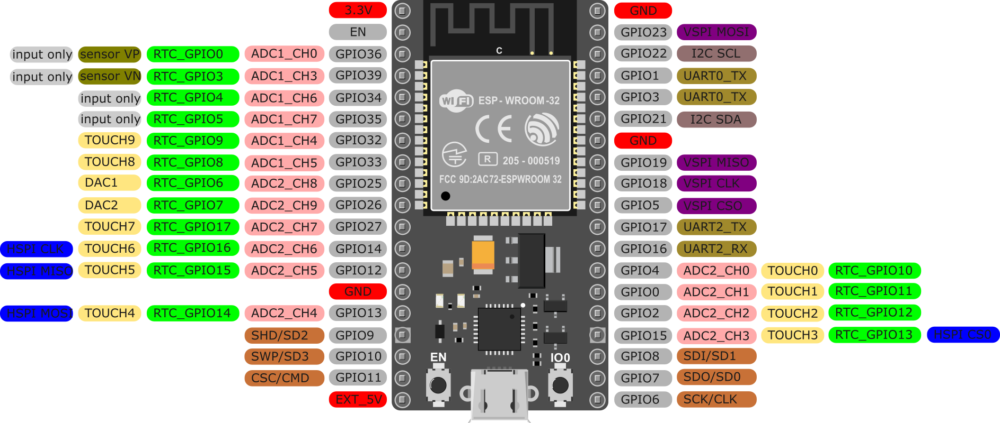 

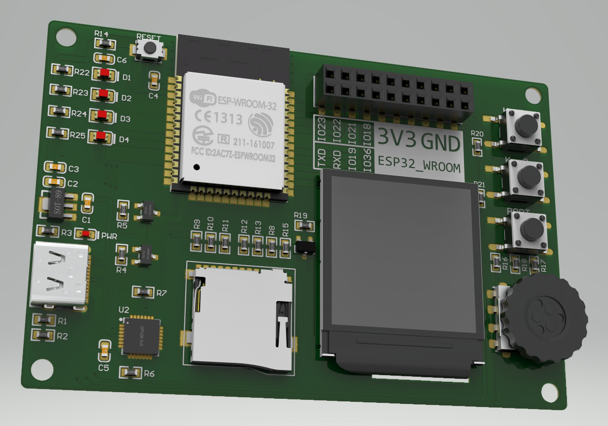 

### 1.1 限制使用的引脚

#### 1.1.1 仅作为输入的引脚

- GPIO34
- GPIO35
- GPIO36 (SENSOR_VP)
- GPIO39 (SENSOR_VN)

#### 1.1.2 SPI Flash 使用的引脚

ESP32-WROOM-32 模组内部集成了一个SPI Flash芯片，使用了ESP32的以下引脚，在电路设计中，不要使用这些引脚。

- GPIO6 (SCK/CLK)
- GPIO7 (SDO/SD0)
- GPIO8 (SDI/SD1)
- GPIO9 (SDH/SD2)
- GPIO10 (SWP/SD3)
- GPIO11 (CSC/CMD)

------

### 1.2 Strapping 引脚

- GPIO0
- GPIO2
- GPIO5
- GPIO12 (MTDI)
- GPIO15 (MTDO)

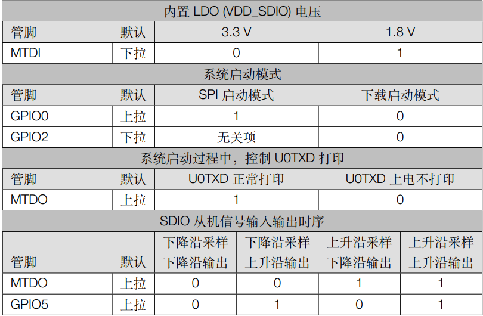 

**ESP32 模组上电时，必须保证GPIO12 (MTDI)为低电平，GPIO5为高电平**，否则会导致ESP32 模组工作异常；其余引脚与程序下载相关，程序下载电路如下图所示（GPIO2 应在上电时保持为低电平）

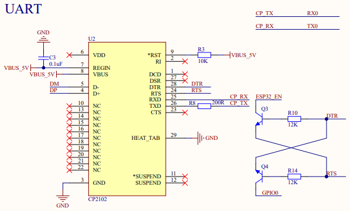 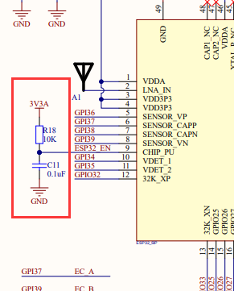 

------

### 1.3 SPI 引脚

#### 1.3.1 SPI 引脚说明

ESP32 模组有4组SPI，其中SPI0 和 SPI1 已经被模组内部使用，用户可使用 **HSPI (SPI2) 和 VSPI (SPI3)** , HSPI 与 VSPI 只是名称不同，其最高速度均为80MHz

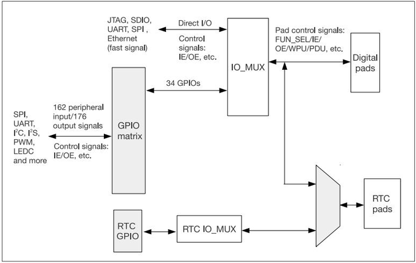 

ESP32 有34个物理引脚 (pad)，每个引脚都可以用作一个通用的IO，或连接内部的外设信号。IO_MUX、RTC IO_MUX 和 GPIO 交换矩阵用于将信号从外设传输至GPIO pad，这些模块共同组成了芯片的IO控制。

1. IO_MUX 中每个 GPIO pad 有一组寄存器。每个 pad 可以配置成 GPIO 功能（连接 GPIO 交换矩阵）或者直连功能（旁路 GPIO 交换矩阵，快速信号如以太网、SDIO、SPI、JTAG、UART 等会旁路 GPIO 交换矩 阵以实现更好的高频数字特性。所以高速信号会直接通过 IO_MUX 输入和输出。）

2. GPIO 交换矩阵是外设输入、输出信号和 pad 之间的全交换矩阵。
   - 芯片输入方向：162 个外设输入信号都可以选择任意一个GPIO pad 输入；
   - 芯片输出方向： 每个GPIO pad 的输出信号都可以来自176个外设输出信号中的一个；
3. RTC IO_MUX 用于控制 GPIO pad 的低功耗和模拟功能，只有部分GPIO pad 具有这些功能。

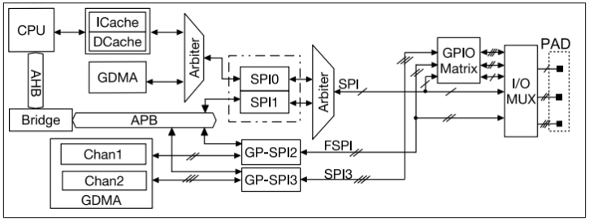 

快速信号如以太网、SDIO、SPI、JTAG、UART 等会旁路 GPIO 交换矩阵以实现更好的高频数字特性。所以高速信号会直接通过 IO_MUX 输入和输出。 这样比使用 GPIO 交换矩阵的灵活度要低，即每个 GPIO pad 的 IO_MUX 寄存器只有较少的功能选择，但可以实现更好的高频数字特性。当HSPI、VSPI 仅使用下表中的引脚才可以达到80MHz的通信速度。

|          | CS0  | CLK  | MISO | MOSI | QUADWP | QUADHD |
| -------- | ---- | ---- | ---- | ---- | ------ | ------ |
| **HSPI** | 15   | 14   | 12   | 13   | 2      | 4      |
| **VSPI** | 5    | 18   | 19   | 23   | 22     | 21     |

**如果SPI使用GPIO 交换矩阵，那么最高通信速度会被限制到26.6MHz。**

#### 1.3.2 SPI 示例程序

Arduino 使用SPI 需要包含库文件 #include <SPI.h>。每个 ESP32 SPI 主机默认最多可接3个从机，**在非DMA模式下，一次最多可以接收/发送64字节数据。**

##### 1、初始化SPI 总线

``` cpp
SPIClass sx1280SPI = SPIClass(VSPI); 
sx1280SPI.begin(SX_CLK,SX_MISO,SX_MOSI,SX_CS);
pinMode(sx1280SPI.pinSS(),OUTPUT);  
```

##### 2、主机发送数据

``` cpp
sx1280SPI.beginTransaction(SPISettings(15000000,MSBFIRST,SPI_MODE0));	//设置传输参数
digitalWrite(sx1280SPI.pinSS(),LOW);									//拉低片选
sx1280SPI.transferBytes(_txbuf,_rxbuf,_len);							//传输数据
digitalWrite(sx1280SPI.pinSS(),HIGH);									//拉高片选
sx1280SPI.endTransaction();												//结束传输
sx1280SPI.end();	//释放SPI总线，用作其他GPIO功能

//void begin(int8_t sck = -1, int8_t miso = -1, int8_t mosi = -1, int8_t ss = -1);
//void end();	//释放总线，并解除引脚的绑定
//void beginTransaction(SPISettings settings);	//设置SPI 传输的相关参数
//void endTransaction(void);	结束传输，不释放总线(仍然是SPI功能)

/* SPI 主机库数据传输方法 */
void transfer(void * data, uint32_t size);	
uint8_t transfer(uint8_t data);
uint16_t transfer16(uint16_t data);
uint32_t transfer32(uint32_t data);

void transferBytes(const uint8_t * data, uint8_t * out uint32_t size); //发送并接收 size 个字节数据(out 接收)
void transferBits(uint32_t data, uint32_t * out, uint8_t bits);

void write(uint8_t data);
void write16(uint16_t data);
void write32(uint32_t data);
void writeBytes(const uint8_t * data, uint32_t size);
void writePixels(vonst void * data, uint32_t size);
void writePattern(const uint8_t * data, uint8_t size, uint32_t repeat);
```

##### 3、主机接收数据

``` cpp
uint8_t ret = 0;
sx1280SPI.beginTransaction(SPISettings(15000000,MSBFIRST,SPI_MODE0));
digitalWrite(sx1280SPI.pinSS(),LOW);
ret = sx1280SPI.transfer(_txbyte);
digitalWrite(sx1280SPI.pinSS(),HIGH);
sx1280SPI.endTransaction();

return ret;
```

------

### 1.4 I2C 引脚

ESP32 有两个I2C通道，任何引脚都可以设置为SDA 或 SCL，根据用户的配置，总线接口可以用作I2C 主机 或 I2C 从机。I2C接口支持：

- 标准模式 (100 Kbit/s)；
- 快速模式 (400 Kbit/s)；
- 支持 7-bit 以及 10-bit 寻址；
- 支持多主机多从机通信；
- 支持主机模式以及从机模式；
- 支持关闭 SCL 时钟实现连续数据传输；
- 支持可编程数字噪声滤波功能；

#### I2C 示例程序

Arduino 使用I2C 需要包含库文件 #include <Wire.h> 两个I2C通道分别对应库中的 Wire 和 Wire1。

##### 1、初始化I2C 总线

``` cpp
Wire.begin();	//作为I2C 主机加入，SDA = GPIO21 , SCL = GPIO22 , Frequency = 100KHz
Wire.begin(25,26); //作为I2C 主机加入，SDA = GPIO25 , SCL = GPIO26 , Frequency = 100KHz
Wire.begin(25,26,150000); //作为I2C 主机加入，SDA = GPIO25 , SCL = GPIO26 , Frequency = 150KHz

Wire.begin(27);	//作为I2C 从机加入，地址 = 27 , SDA = GPIO21 , SCL = GPIO22 , Frequency = 100KHz
Wire.begin(27,25,26,200000); //作为I2C 从机加入，地址 = 27 , SDA = GPIO25 , SCL = GPIO26 , Frequency = 200KHz
```

##### 2、主机发送数据

发送数据前一定要使用Wire.beginTransmission() 函数启动I2C 传输，发送数据后一定要使用Wire.endTransmission() 结束传输。

``` cpp
byte val = 80;
Wire.beginTransmission(0x27);				//发送数据前启动传输
Wire.write(val);			
Wire.endTransmission(bool sendStop = true); //发送数据后结束传输(true 释放总线，false 占用总线)
//Wire.endTransmission 返回值说明：
//0：成功
//1：数据过长，超出发送缓冲区
//2：在地址发送时接收到NACK信号
//3：在数据发送时接收到NACK信号
//4：其他错误
//5：超时

size_t Wire.write(uint8_t);					//发送一个字节的数据
size_t Wire.write(const uint8_t *, size_t);	//发送一个字节的数组
inline size_t Wire.write(const char * s);	//发送一个字符串
//返回值均为成功传输的字节数
```

##### 3、主机扫描I2C设备的器件地址

可通过Wire.endTransmission() 函数的返回值来扫描当前I2C通道上的设备地址。

``` cpp
Wire.begin(ADC_SDA,ADC_SCL,100000);
/* 查找I2C 设备 */
for (uint8_t address = 0x01; address < 0x7F; address++)
{
	Wire.beginTransmission(address);
	if (Wire.endTransmission() == 0)
	{
		Serial.printf("I2C device found at address 0x%02x\r\n",address);
    }
}
```

##### 4、主机接收数据

主机要向从机读取数据，要用requestFrom方法进行请求，返回的字节数就是可以用read方法来接收的数据的数量。

``` cpp
void loop()						//示例一
{
    Wire.requestFrom(0x27,6);	//向地址为0x27的设备请求6个字节的数据
    while(Wire.available()){	//从机发送的数据可能不满6个，判断接收缓冲区中有多少个字节数据可读
        char c = Wire.read();	//读取数据
        Serial.print(c);
    }
    delay(500);
}

void loop()						//示例二
{
    int len = Wire.requestFrom(0x27,6);
    if(len > 0){
        byte* buf = new byte[len];
        Wire.readBytes(buf,len);//一次读多个字节的数据
    }
}
// size_t readBytesUntil(char terminator, uint8_t *buffer, size_t length)	//一次读取多个字节或碰到结束符terminator 为止
```

------

### 1.5 ADC 引脚

ESP32 有 18 x 12位ADC 输入通道，具体引脚见首页图。

#### 示例程序

``` cpp
// Potentiometer is connected to GPIO 34 (Analog ADC1_CH6) 
const int potPin = 34;
 
// variable for storing the potentiometer value
int potValue = 0;
 
void setup() {
  Serial.begin(115200);
  delay(1000);
}
 
void loop() {
  // Reading potentiometer value
  potValue = analogRead(potPin);
  Serial.println(potValue);
  delay(500);
}
```

------

### 1.6 DAC 引脚

ESP32 有2 x 8位DAC通道，用于将数字信号转换为模拟电压信号输出。DAC通道的引脚是：

- DAC1 (GPIO25)
- DAC2 (GPIO26)

#### 示例程序

``` cpp
#include <Arduino.h>
#include <esp32-hal-dac.h>//DAC功能引用该库，可以不进行#include<>引用
 
//查看源码后得到，DAC引脚只能是这两个引脚
#define LED1 25
#define LED2 26
 
void setup(){
  //DAC的IO口也可以不进行初始化
  pinMode(LED1,OUTPUT);
  pinMode(LED2,OUTPUT);
}
 
void loop()
{
  // 逐渐变亮
  for (int dutyCycle = 0; dutyCycle <= 255; dutyCycle = dutyCycle + 1)
  {
    dacWrite(LED1, dutyCycle);  	  // 输出DAC
    dacWrite(LED2, 255 - dutyCycle);  // 输出DAC
    delay(5);
  }
  // 逐渐变暗
  for (int dutyCycle = 255; dutyCycle >= 0; dutyCycle = dutyCycle - 1)
  {
    dacWrite(LED1, dutyCycle);  	  // 输出DAC
    dacWrite(LED2, 255 - dutyCycle);  // 输出DAC
    delay(5);
  }
}
```

------

### 1.7 外部中断引脚

ESP32 所有引脚都可以设置为外部中断，但需要注意Strapping 引脚的上电状态。

#### 示例程序

``` cpp
void IRAM_ATTR EC_KEY_Interrupt();               //编码器按键中断函数

uint8_t input_state = 0;                         //按键键值，在lv_port_indev.c中被调用

/* 编码器初始化 */
void Encoder_init()
{
  pinMode(EC_A,INPUT);      //外部已上拉
  pinMode(EC_B,INPUT);      //外部已上拉
  pinMode(EC_KEY,INPUT);    //外部已上拉
  /*  CW（顺时针） A上升沿时， B为低电平     CCW A上升沿时， B为高电平    */
  attachInterrupt(digitalPinToInterrupt(EC_A), EC_KEY_Interrupt, RISING); 
}
/* 编码器按键中断函数 */
void IRAM_ATTR EC_KEY_Interrupt() 
{
    uint8_t EC_B_Value = gpio_get_level((gpio_num_t)EC_B);

    if(EC_B_Value == 1 ){       // 逆时针旋转
        input_state  = 2;
    }
    else if(EC_B_Value == 0){   // 顺时针旋转  
        input_state = 3;
    }
}
```

------

### 1.8 LEDC

LEDC 是指LED PWM控制器，主要用于控制LED的亮度和颜色，也可以产生PWM信号用于其他用途。LED_PWM有16路通道 (0-15) ，即8路高速通道 (0-7) 和 8路低速通道 (8-15)。这16路通道能够产生独立的数字波形来驱动 RGB LED 设备。高速通道由80MHz时钟驱动，低速通道由8MHz时钟驱动。PWM输出主要针对LED的驱动（但实际应用中不限制）。可以在**不占用**处理器的资源的情况下，实现对占空比和频率的控制；**ESP32中所有支持数据输出口的接口都可以输出PWM信号。**

**double ledcSetup(uint8_t channel, double freq, uint8_t resolution_bits) ;** 该函数用于设置LEDC通道对应的频率和分辨率，设置成功返回ledc的通道号，失败返回0。

- channel 为通道号，取0-15；
- freq 为期望设置的频率；
- resolution_bits 为分辨率位数，例resolution_bits = 8 则表示为$2^8$

下图是高速LED_PWM通道频率和精度的对应关系。

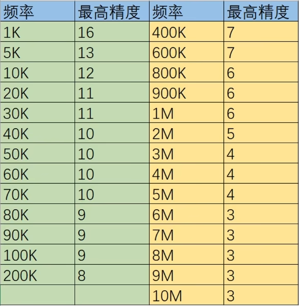 

**void ledcAttachPin(uint8_t pin, uint8_t channel); 和 void ledcDetachPin(uint8_t pin);** 将LEDC通道绑定到指定GPIO上以实现输出或从指定GPIO解绑。其中，一个通道可以绑定多个GPIO ，其绑定的GPIO输出的PWM波形一致。

**void ledcWrite(uint8_t channel, uint32_t duty);** 设置指定LEDC通道的占空比。

**uint32_t ledcRead(uint8_t channel);** 读取指定通道的占空比；

**double ledcReadFreq(uint8_t channel);** 读取指定通道的PWM频率；

**double ledcChangeFrequency(uint8_t channel, double freq, uint8_t bit_num);** 修改指定通道的PWM频率和分辨率（类似于ledcSetup()函数）。

#### 示例程序

``` cpp
int ret = 0;
Serial.begin(115200);
int ch0 = 0;
int gpio4 = 4;
ret = ledcSetup(ch0,5000,12);								  //1、设置参数
delay(200);
if(ret == 0){
    Serial.println("Error Setup");
}
else{
    Serial.println("Success Setup");
}
ledcAttachPin(gpio4,ch0);									  //2、绑定通道
ledcWrite(ch0,pow(2,11));	//2^11 ,精度为2^12 ，则占空比为50%	//3、设置占空比
```

------

### 1.9 串口通信

UART **是通用异步收发器**，是一种双向、串行、异步的通信总线，仅用一根数据接收线和一根数据发送线就能实现全双工通信。典型的串口通信使用三根线完成，分别是：**TX、RX、GND**。

**同步通信**：同步通信是一种**比特**同步通信技术，要求收发双方具有同频同相的同步时钟信号，在同步时钟信号的控制下逐位发送/接收数据，对时钟信号有严格精确的要求，所以**同步通信都有一条时钟线**。如SPI、I2C通信均属于同步通信。

**异步通信**：以字符为传输单位，每个字符都要附加1位起始位和1位停止位，以标记一个字符的开始和结束，并以此实现数据传输同步。收发双方可以有自己各自的时钟。字符与字符（一个字符结束到下一个字符开始）之间的时间间隔是可变的，并不需要严格地限制它们的时间关系。发送端与接收端除了**采用相同的数据格式**（字符的位数、停止位的位数、有无校验以及校验方式等）外，**还应当采用相同的传输速率**（波特率）。

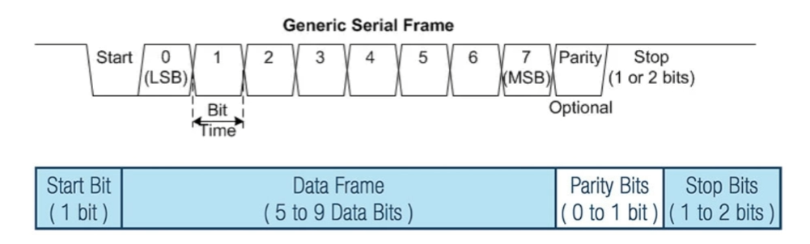 

一个串行通信的字符帧格式为：

1. 数据帧起始位：低电平 (1bit)；
2. 数据位：5 - 9 bit；
3. 奇偶校验：奇校验、偶校验、无校验；
4. 停止位：1 - 2 bit 的高电平；

ESP32 芯片中有3个UART 控制器可以使用，分别是UART0,UART1,UART2，其特点是：

- 可编程收发波特率；
- 支持输入信号波特率自检功能；
- 3个UART的发送FIFO和接收FIFO共享1024 x 8-bit RAM；
- 全双工异步通信；
- 支持5/6/7/8位数据长度；
- 支持1/1.5/2/3个停止位；
- 支持奇偶校验；

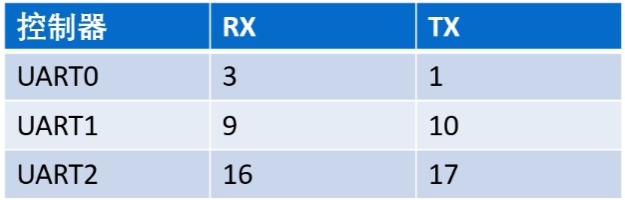 

UART0 用于下载程序，调试串口，引脚不可改变；UART1默认的引脚GPIO9 和 GPIO10被FLASH 所占用，不能使用，所以要使用UART1需要更改TX、RX的GPIO口；UART2不用更改引脚可以正常使用。

#### 函数说明

``` cpp
/* 函数原型 */

/* 初始化 */
void begin(unsigned long baud, uint32_t config = SERIAL_8N1, int8_t rxPin = -1, int8_t txPin = -1, bool invert = false,
          unsigned long timeouts_ms = 20000UL, uint8_t rxfifo_full_thrhd = 112);
//band:波特率，可随便设置，保证收发双方一致即可，如果设置为0，则该函数会自动检测串口的波特率
//config:字符帧格式，默认是8位数据位，1位停止位，无校验
//txPin:发引脚
//rxPin:收引脚
//invert:是否交换收发引脚
//timeout_ms:自动检测波特率的超时时间 ms
//rxfifo_full_thrhd:触发UART_INTR_RXFIFO_FULL 中断的阈值	默认收到112字节数据会触发中断

void end(bool fullyTerminate = true);
//true:表示完成停止串口的功能，包括传进去的事件的回调函数全部清空
//false:还可以再调用一次begin来初始化串口，继续使用

/* 参数修改 */
//begin()调用后使用
void updateBaudRate(unsigned long baud);	//更新波特率
void setPins(int8_t rxPin, int8_t txPin, int8_t ctsPin = -1, int8_t rtsPin = -1); //设置引脚
uint32_t baudRate(); 	//获取当前波特率
operator bool() const;	//串口是否初始化成功

/* 调整缓冲区大小 */
size_t setRxBufferSize(size_t new_size);	//begin调用前调用，new_size 必须大于128
size_t setTxBufferSize(size_t new_size);	//begin调用前调用，new_size 必须大于128

/* 轮询接收数据与发送数据 */
int available(void);		//收缓冲区有多少数据可以读取
int availableForWrite(void);//最多可以发送多少数据
int peek(void);				//收缓冲区的第一个字节，如果不存在则返回 -1 ，读时不将数据移除缓冲区
int read(void);				//读一个字节数据，返回 -1 表示没有数据
size_t read(uint8_t * buffer, size_t size);//读入最多size个字节的数据，返回实际读取的字节数
void flush(void);			//强制把缓冲区的数据发送到总线上
void flush(bool txOnly);	//强制把缓冲区的数据发送到总线上
size_t write(uint8_t);		//发送一个字节，返回真实发送的字节
size_t write(const uint8_t * buffer, size_t size);//发送size个字节的数据，返回真实发出的数量
```

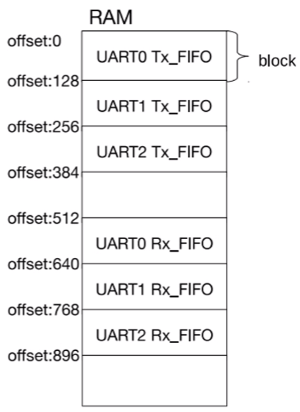 

ESP32 中3个UART控制器共用 1024 x 8-bit 的RAM空间，RAM以block为单位进行分配，1 block = 128 x 8 bit。需要注意的是当扩展某一个UART的FIFO空间时，可能会占用其他UART的FIFO空间，所以尽量不要修改UART的FIFO空间。

#### UART 事件回调

前面所示的函数在接收数据时使用的是轮询的方式，需要不断查询是否有数据可读；也可以使用事件的方式，我们提供一个回调函数，在收到数据（符合一定条件）时调用这个函数。

``` cpp
void setRxTimeout(uint8_t symbols_timeout); //symbols_timeout 表示传输一个字符帧的时间的倍数，当rx信号线上保持空闲状态超过这个时间，
//就会调用设置接收的回调函数(用于数据的断帧) 一般是2倍
void setRxFIFOFull(uint8_t fifoBytes);	//定义一个阈值，接收缓冲区的数据量达到这个阈值就会触发UART_INTR_FXFIFO_FULL 中断，默认是120字节
void onReceive(OnReceiveCb function, bool onlyOnTimeout = false);//function:收到数据的回调函数，类型是void(void)
//onlyOnTimeout:定义这个回调函数是否只有在中断 UART_INTR_FXFIFO_TOUT 发生时调用， 一般选择false ，在UART_INTR_FXFIFO_FULL 中断发生时也会调用
void onReceiveError(OnReceiveErrorCb function);//发生错误时调用回调函数
```

#### 示例程序

``` cpp
/* 轮询接收 */
void setup(){
    Serial.begin(115200);
}
void loop(){
    char buf[128];
    if(Serial.available()){
        int count = Serial.read(buf,128);
        Serial.printf("Recv length : %d : ",count);
        Serial.write(buf,count);
        Serial.println();
    }
}

/* 事件方式 */
void onRecv()	
{
    uint8_t buf[128];
    int count = Serial.read(buf,128);
    Serial.printf("Recv length : %d : ",count);
    if(count > 0){
        Serial.write(buf,count);
    }
    Serial.println();
}
void setup()
{
    Serial.begin(115200);
    Serial.onReceive(onRecv,false);		//设置回调函数
}
```

## 二、其他外设

### 2.1 定时器

ESP32 有4个硬件定时器（提供两组硬件定时器，每组包含两个通用硬件定时器）所有定时器均为64位通用定时器，包括16位预分频器和64位自动重载向上/向下计数器。每个定时器都以APB作为时钟，频率一般为80MHz，ESP32中预分频器是16位的，所以最大的分频数是**65535**。

#### 示例程序

``` cpp
hw_timer_t * timer = NULL;

void IRAM_ATTR onTimer(){
    //定时器中断函数
}
timer = timerBegin(0,80,true);				//初始化定时器0；80分频，时基1us；true向上计数 false向下计数
timerAttachInterrupt(timer,onTimer,true);	//定时器与中断函数绑定
timerAlarmWrite(timer,1000000,true);		//1s触发一次中断；周期定时
timerAlarmEnable(timer);					//开启定时器 

//常使用二值信号量来进行中断和任务之间的同步
```

------

### 2.2 蓝牙

蓝牙使用2.4G频道、是一种近距离，低功耗的无线通信技术。蓝牙基本分为**经典蓝牙**和**BLE蓝牙（低功耗蓝牙）**两种。

**经典蓝牙**：蓝牙3.0以下的版本，都是经典蓝牙，3.0以上版本，使用**BR/EDR技术的也是经典蓝牙**，具有功耗高、数据传输量大、传输距离短（10米）等特点。

**BLE 蓝牙**：通常说的蓝牙4.0（及以上版本）中**使用LE技术的蓝牙**。具有功耗低、传输数据量小、传输距离远（50米左右）等特点，其缺点是传输速度比较慢。低功耗蓝牙多用于手环/智能手表/信标等数据量低，需要低功耗的设备中。

**传声音，大量数据的，用经典蓝牙；电池供电，连手机APP的，用BLE 蓝牙；既要声音又要数据的用双模蓝牙（同时支持经典蓝牙和BLE蓝牙）。**

#### 2.2.1 经典蓝牙从机

ESP32 中通过BluetoothSerial 类实现SPP服务（蓝牙串口）；BluetoothSerial分为主设备和从设备。需要包含头文件 #include "BluetoothSerial.h"

**主设备**：可以与一个从设备进行连接。在此模式下可以对周围设备进行搜索并选择需要连接的从设备进行连接，理论上一台主机最多可以连接7台从机。

**从设备**：只能被主机搜索，不能主动搜索。从设备和主机连接以后，也可以和主机设备进行发送和接收数据。BluetoothSerial 类设置成从设备只允许一台主机连入第二个接入的连接会被马上关闭掉。

**主要区别**：主机是指能够搜索其他设备并主动建立连接的一方，从机不能主动建立连接，只能等待主设备连接自己。

##### 获取本机蓝牙设备地址

``` cpp
#include <esp_bt_main.h>
#include <esp_bt_device.h>
#include <esp32-hal.h>

btStart();								//启用蓝牙功能
esp_bluedroid_init();					//初始化蓝牙协议栈
esp_bluedroid_enable();					//启用蓝牙协议栈
auto address = esp_bt_dev_get_address();//获取本机的蓝牙mac地址
if(address){
    for(int i = 0; i < 6; i++){
        Serial.printf("%02X",address[i]);
        if(i < 5){
            Serial.print(":");
        }
    }
    Serial.println();
}
```

##### 函数说明

``` cpp
bool begin(String localName = String(), bool isMaster = false); //初始化蓝牙，localName:蓝牙名，空为"ESP32" isMaster:设置主机/从机(默认)
bool hasClient(void); //是否有设备已经连接
bool disconnect();	  //关闭当前的spp连接
bool isClosed();	  //spp连接是否已经关闭
bool isReady(bool checkMaster = false, int timeout = 0); //检测spp信道是否可用，checkMaster = true还会检测本机是否是主机，不是的话也会返回false
void end(void);		  //关闭蓝牙功能
bool unpairDevice(uint8_t remoteAddress[]);//接触指定地址的蓝牙设备的配对

/* 收发数据 */
int available(void); 	//有多少数据可以读
void setTimeout(int timeoutMS);//设置读写的超时时间，默认是0，马上返回
int peek(void);			//读缓冲区第一字节，如果读取错误，返回-1 (不会将数据从缓冲区移除)
int read(void);			//读取一个字节，如果读取错误，返回-1
size_t write(uint8_t c);//发送一个字节
size_t write(const uint8_t * buffer, size_t size);//最多发送size个字节，返回成功发送的字节数
size_t print();
size_t printf();
size_t println();		//三个print系列函数都是返回实际发送的字节
void flush();			//将数据从缓冲区强制送入信道

size_t readBytes(char * buffer, size_t length); 
size_t readBytes(char terminator, char * buffer, size_t length);	//读到终止符terminator为止
String readString();
String readStringUntil(char terminator);
```

##### 示例程序1：简单收发

``` cpp
#include "BluetoothSerial.h"

BluetoothSerial SerialBT;

/*通信前要先配对蓝牙，目前这种情况（无ssp）是不需要密码的，主机可以直接配对成功。可以有多个主机配对成功，但只有第一个主机能够成功保持连接（库的特性）*/

void setup(){
    Serial.begin(115200);
    SerialBT.begin("ESP32Fish");
    Serial.println("The device started, now you can pair it with bluetooth!");
}

void loop(){
    char buf[129];
    if(SerialBT.available()){
        auto sz = SerialBT.readBytes(buf,128);
        if(sz){
            buf[sz] = 0;
            Serial.println(buf);
            strcat(buf," - Slave");
            SerialBT.write((uint8_t*)buf,strlen(buf));
        }
    }
    delay(20);
}

/* 利用回调函数实现数据接收 */
#include "BluetoothSerial.h"

BluetoothSerial SerialBT;

void RecvData(const uint8_t * buffer, size_t size)
{
    if(size > 0){
        Serial.write(buffer,size);
        SerialBT.write(buffer,size);
        SerialBT.println(" - Slave");
    }
}

void setup(){
    Serial.begin(115200);
    SerialBT.onData(RecvData);
    SerialBT.begin("ESP32Fish");
    Serial.println("The device started, now you can pair it with bluetooth!");
}
```

##### 示例程序2：SPP 启用 SSP 认证

``` cpp
#include "BluetoothSerial.h"

BluetoothSerial SerialBT;  //定义一个蓝牙对象

//认证请求回调
void BTConfirmRequestCallback(uint32_t numVal)
{
  //numVal是主机发来的识别码
  Serial.printf("recv pin: %d \r\n", numVal);

  //这里要对这个识别码进行判断，是否和主机一样或是是否是我们从机内置的密码
  //然后再判断是否确定连接，我们这里直接确认了
  SerialBT.confirmReply(true);
  //SerialBT.confirmReply(false);  //如果要拒绝就用这句
}

//认证结果回调函数
void BTAuthCompleteCallback(boolean success)
{
  if (success)
    Serial.println("Pairing success!!");
  else
    Serial.println("Pairing failed, rejected by user!!");
}

void RecvData(const uint8_t *buffer, size_t size)
{
  if(size > 0)
  {
    Serial.write(buffer, size);  //打印出来
    SerialBT.write(buffer, size);
    SerialBT.println(" - Slave");
  }
}

void setup() {
  SerialBT.enableSSP(); //在begin之前调用
  SerialBT.onConfirmRequest(BTConfirmRequestCallback);
  SerialBT.onAuthComplete(BTAuthCompleteCallback);
  Serial.begin(115200);
  SerialBT.onData(RecvData);   //注册接收回调函数
  SerialBT.begin("ESP32Fish");  //蓝牙的名字叫ESP32Fish, 从机模式
  Serial.println("The device started, now you can pair it with bluetooth!");
}

void loop() {
}
```

##### 示例程序3：SPP 事件处理

BluetoothSerial 类没有提供获取当前连接的蓝牙设备地址的方法，我们根据SPP 事件来做一个，当SPP连接事件发生时，我们记录连接上来的设备地址，当连接关闭时，删除地址。

``` cpp
#include "BluetoothSerial.h"
#include <esp_spp_api.h>
#include <map>

BluetoothSerial SerialBT;  //定义一个蓝牙对象
std::map<uint32_t, BTAddress*> remote;  //远程的蓝牙对象

void RecvData(const uint8_t *buffer, size_t size)
{
  if(size > 0)
  {
    Serial.write(buffer, size);  //打印出来
    SerialBT.write(buffer, size);
    SerialBT.println(" - Slave");
  }
}

//蓝牙事件回调函数
void bluetooth_Event(esp_spp_cb_event_t event, esp_spp_cb_param_t *param) 
{
    if(event == ESP_SPP_OPEN_EVT || event == ESP_SPP_SRV_OPEN_EVT) //蓝牙连接成功标志 
    {   //蓝牙主机和从机模式对应的标志不同，前面的是从机模式的，后面是主机模式
        BTAddress* address = NULL;
        uint32_t hd = 0;
        if(event == ESP_SPP_OPEN_EVT)
        {
          address = new BTAddress(param->open.rem_bda);
          hd = param->open.handle;
        }
        else
        {
          address = new BTAddress(param->srv_open.rem_bda);
          hd = param->srv_open.handle;
        }

        Serial.printf("device: %s has connected. \r\n", address->toString().c_str());
        remote[hd] = address;
    }
    else if(event == ESP_SPP_CLOSE_EVT)     //蓝牙断开连接标志
    {
      auto pDev = remote[param->close.handle];
      Serial.printf("device: %s disconnect successful!\r\n", pDev->toString().c_str());
      delete pDev;
      remote.erase(param->close.handle);
    }
    else if(event == ESP_SPP_DATA_IND_EVT)  //数据接收标志
    {
        Serial.write("  receive complete! \r\n");
    }
    else if(event == ESP_SPP_WRITE_EVT)     //数据发送标志
    {
        Serial.write("  send complete! \r\n");
    }
}

void setup() {
  SerialBT.register_callback(bluetooth_Event);
  Serial.begin(115200);
  SerialBT.onData(RecvData);   //注册接收回调函数
  SerialBT.begin("ESP32Fish");  //蓝牙的名字叫ESP32Fish, 从机模式
  Serial.println("The device started, now you can pair it with bluetooth!");
}

void loop() {
}
```

#### 2.2.2 经典蓝牙主机

##### 示例程序1：蓝牙搜索

``` cpp
#include "BluetoothSerial.h"
#include <esp_bt_device.h>
#define LEDPIN 2

/* 阻塞方式进行蓝牙搜索 */
BluetoothSerial SerialBT;  //定义一个蓝牙对象

void setup() {
  pinMode(LEDPIN, OUTPUT);
  digitalWrite(LEDPIN,LOW);
  Serial.begin(115200);
  if(!SerialBT.begin("ESP32Fish2", true))
  {
    Serial.println("BT begin failed.");
    return;
  }
  delay(1500);
  auto ret = SerialBT.discover(10000);
  if(ret == NULL)
  {
    Serial.println("discover failed");
    return;
  }
  digitalWrite(LEDPIN, HIGH);

  int count = ret->getCount();
  Serial.printf("count: %d\r\n", count);
  for(int i=0; i<count; i++)
  {
    auto dev = ret->getDevice(i);
    if(dev)
    {
      auto name = dev->getName();   //name
      auto rssi = dev->getRSSI();   //rssi
      auto cod = dev->getCOD();     //cod
      auto address = dev->getAddress();
      Serial.printf("dev %d: %s [%s]\r\n", i, name.c_str(), address.toString().c_str());
    }
  }

}

void loop() {
  // put your main code here, to run repeatedly:

}


/* 异步方式进行蓝牙搜索 */
#include "BluetoothSerial.h"
#include <AsyncTimer.h>
#define LEDPIN 2

BluetoothSerial SerialBT;  //定义一个蓝牙对象
AsyncTimer t;				//软件定时器

void Advertised(BTAdvertisedDevice* pDevice) {	//回调函数
  auto name = pDevice->getName();   //name
  auto rssi = pDevice->getRSSI();   //rssi
  auto cod = pDevice->getCOD();     //cod
  auto address = pDevice->getAddress();
  Serial.printf("dev : %s [%s]\r\n", name.c_str(), address.toString().c_str());
}

void setup() {
  pinMode(LEDPIN, OUTPUT);
  digitalWrite(LEDPIN,LOW);
  Serial.begin(115200);
  if(!SerialBT.begin("ESP32Fish2", true))
  {
    Serial.println("BT begin failed.");
    return;
  }
  delay(1500);
  
  if (SerialBT.discoverAsync(Advertised)) {
    Serial.println("find start...");
  } else {
    Serial.println("find error");
    return;
  }

  //10s后取消搜索
  t.setTimeout([]{
    Serial.println("find stop...");
    SerialBT.discoverAsyncStop();
  }, 10000);
}

void loop() {
  t.handle();
  //这里可以在搜索的时候同时干其它事
}
```

#### 2.2.3 经典蓝牙双机通信

##### 示例程序1：主机程序（无ssp）

``` cpp
#include "BluetoothSerial.h"
#define LEDPIN 2

BluetoothSerial SerialBT;  //定义一个蓝牙对象

uint8_t clientAddress[] {0xE0,0x5A, 0x1B, 0x77, 0x83, 0x52};

void RecvData(const uint8_t *buffer, size_t size)
{
  if(size > 0)
  {
    Serial.write(buffer, size);  //打印出来
    Serial.println();
  }
}

void setup() {
  Serial.begin(115200);
  pinMode(LEDPIN, OUTPUT);
  SerialBT.onData(RecvData);   //注册接收回调函数
  if(!SerialBT.begin("ESP32Fish2", true))
  {
    Serial.println("BT begin failed.");
    return;
  }
  auto start = millis();
  //if(!SerialBT.connect("ESP32Fish1"))
  if(!SerialBT.connect(clientAddress))
  {
    Serial.println("connect failed");
    return;
  }
  auto end = millis();

  Serial.printf("Connect successed: %d \r\n", end-start);
}

void loop() {
  if(SerialBT.connected())
  {
     digitalWrite(LEDPIN, HIGH);
     
      auto sz = SerialBT.print("Hello");
      Serial.println(sz);
  }
  else
  {
     digitalWrite(LEDPIN, LOW);
  }
  delay(500);
}
```

##### 示例程序2：从机程序（无ssp）

``` cpp
#include "BluetoothSerial.h"
#include <esp_bt_device.h>
#define LEDPIN 2

BluetoothSerial SerialBT;  //定义一个蓝牙对象

void RecvData(const uint8_t *buffer, size_t size)
{
  if(size > 0)
  {
    Serial.write(buffer, size);  //打印出来
    SerialBT.write(buffer, size);
    SerialBT.println(" - Slave");
  }
}

void setup() {
  pinMode(LEDPIN, OUTPUT);

  Serial.begin(115200);
  SerialBT.onData(RecvData);   //注册接收回调函数
  SerialBT.begin("ESP32Fish1");  //蓝牙的名字叫ESP32Fish, 从机模式
  auto address = esp_bt_dev_get_address();  //获取本机的蓝牙mac地址
  if(address)  //找到地址了
  {
      for(int i=0;i<6;i++)
      {
        Serial.printf("%02X", address[i]);
        if(i<5)
          Serial.print(":");
      }
      Serial.println();
  }

  Serial.println("The device started, now you can pair it with bluetooth!");
}

void loop() 
{
  if(SerialBT.hasClient())
  {
    digitalWrite(LEDPIN, HIGH);
  }
  else
  {
    digitalWrite(LEDPIN, LOW);
  }
  delay(200);
}
```

##### 示例程序3：主机程序（ssp）

``` cpp
#include "BluetoothSerial.h"
#include <AsyncTimer.h>
#define LEDPIN 2

BluetoothSerial SerialBT;  //定义一个蓝牙对象

uint8_t clientAddress[] {0xE0,0x5A, 0x1B, 0x77, 0x83, 0x52};
AsyncTimer t;

//认证请求回调
void BTConfirmRequestCallback(uint32_t numVal)
{
  //numVal是主机发来的识别码
  Serial.printf("recv pin: %d , (y|n) \r\n", numVal);

  int num =0;
  while(true)
  {
    if(Serial.available())
    {
      int ch = Serial.read();
      if(ch=='Y' || ch=='y')
      {
        Serial.println("yes");
        SerialBT.confirmReply(true);
        break;
      }
      else if(ch=='N' || ch=='n')
      {
        Serial.println("no");
        SerialBT.confirmReply(false);
        break;
      }
      if(num++ >=20)
        break;
    }
    delay(500);
  }
}

//认证结果回调函数
void BTAuthCompleteCallback(boolean success)
{
  if (success)
    Serial.println("Pairing success!!");
  else
    Serial.println("Pairing failed, rejected by user!!");
}

void RecvData(const uint8_t *buffer, size_t size)
{
  if(size > 0)
  {
    Serial.write(buffer, size);  //打印出来
    Serial.println();
  }
}

void setup() {
  Serial.begin(115200);
  pinMode(LEDPIN, OUTPUT);
  SerialBT.enableSSP();
  SerialBT.onConfirmRequest(BTConfirmRequestCallback);
  SerialBT.onAuthComplete(BTAuthCompleteCallback);
  SerialBT.onData(RecvData);   //注册接收回调函数
  if(!SerialBT.begin("ESP32Fish2", true))
  {
    Serial.println("BT begin failed.");
    return;
  }
  auto start = millis();
  if(!SerialBT.connect("ESP32Fish1"))
  {
    Serial.println("connect failed");
    return;
  }
  auto end = millis();

  Serial.printf("Connect successed: %d \r\n", end-start);
}

void loop() {
  t.handle();

  if(SerialBT.hasClient())
  {
    digitalWrite(LEDPIN, HIGH);
     
    SerialBT.print("Hello");
  }
  else
  {
    digitalWrite(LEDPIN, LOW);
  }

  delay(2000);
}
```

##### 示例程序4：从机程序（ssp）

``` cpp
#include "BluetoothSerial.h"
#include <esp_bt_device.h>
#define LEDPIN 2

BluetoothSerial SerialBT;  //定义一个蓝牙对象

//认证请求回调
void BTConfirmRequestCallback(uint32_t numVal)
{
  //numVal是主机发来的识别码
  Serial.printf("recv pin: %d \r\n", numVal);
  SerialBT.confirmReply(true);
}

//认证结果回调函数
void BTAuthCompleteCallback(boolean success)
{
  if (success)
    Serial.println("Pairing success!!");
  else
    Serial.println("Pairing failed, rejected by user!!");
}

void RecvData(const uint8_t *buffer, size_t size)
{
  if(size > 0)
  {
    Serial.write(buffer, size);  //打印出来
    SerialBT.write(buffer, size);
    SerialBT.println(" - Slave");
  }
}

void setup() {
  pinMode(LEDPIN, OUTPUT);
  SerialBT.enableSSP(); //在begin之前调用
  SerialBT.onConfirmRequest(BTConfirmRequestCallback);
  SerialBT.onAuthComplete(BTAuthCompleteCallback);
  Serial.begin(115200);
  SerialBT.onData(RecvData);   //注册接收回调函数
  SerialBT.begin("ESP32Fish1");  //蓝牙的名字叫ESP32Fish, 从机模式
  auto address = esp_bt_dev_get_address();  //获取本机的蓝牙mac地址
  if(address)  //找到地址了
  {
      for(int i=0;i<6;i++)
      {
        Serial.printf("%02X", address[i]);
        if(i<5)
          Serial.print(":");
      }
      Serial.println();
  }

  Serial.println("The device started, now you can pair it with bluetooth!");
}

void loop() 
{
  if(SerialBT.hasClient())
  {
    digitalWrite(LEDPIN, HIGH);
  }
  else
  {
    digitalWrite(LEDPIN, LOW);
  }
  delay(200);
}
```

#### 2.2.4 BLE 蓝牙

BLE 蓝牙分为**主机、从机、观察者和广播者**四个角色。

**主机**：主机可以发起对从机的连接。例如手机，通常作为BLE的主机设备。

**从机**：从机只能广播并等待主机的连接。例如只能手环。

**观察者**：观察者监听空中的广播事件，和主机的唯一区别是不能发起连接，只能持续扫描从机。

**广播者**：广播者可以持续广播信息，和从机的唯一区别是不能被主机连接，只能广播数据。

同一个BLE设备，既可以作为主机，也可以作为从机就。广播是指从机每经过一个时间间隔广播一次数据包，这个时间间隔称为广播间隔，这个广播动作叫做广播事件，**只有当从机处于广播状态时，主机才能发现该从机。**

在每个广播事件中，广播包会分别在37、38、39三个信道上依次广播，广播的时间间隔范围从20ms到10.24s，广播间隔会影响建立连接的速度，广播间隔越大，连接速度越慢。

扫描是主机监听从机广播数据包和发送扫描请求的过程，主机通过扫描，可以获得从机的广播包以及扫描回应数据包，主机可以对已扫描到的从机设备发起连接请求，从而连接从机设备并通信，扫描分为被动扫描和主动扫描。被动扫描是指主机监听广播信道的数据，当接到广播包时，协议栈将向上层传递广播包。主动扫描是指除了完成被动扫描的动作外，还会像从机发送一个扫描请求，从机收到该请求时，会再次发送一个称作扫描回应的广播包。

**BLE 蓝牙的状态转换如下图：**

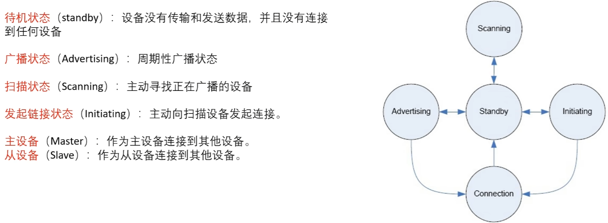 

### 2.2 DMA

直接存储访问 (Direct Memory Access, DMA) 用于在外设与存储器之间以及存储器与存储器之间提供高速数据传输。可以在无需任何 CPU 操作的情况下通过 DMA 快速移动数据，从而提高了 CPU 的效率。 **ESP32 中有 13 个外设都具有 DMA 功能，这 13 个外设是：UART0、UART1、UART2、SPI1、SPI2、SPI3、I2S0、 I2S1、SDIO slave、SD/MMC host、EMAC、BT 和 Wi-Fi。**


